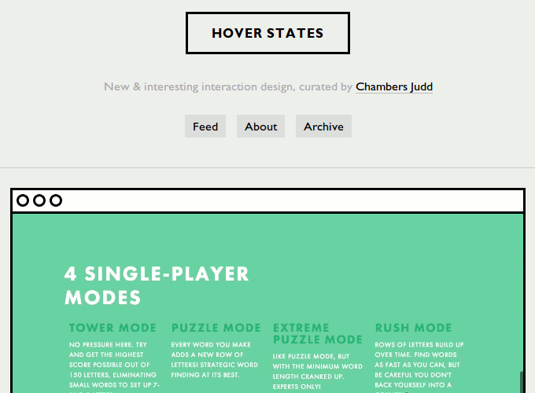
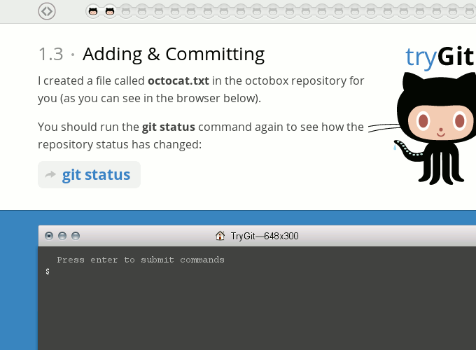
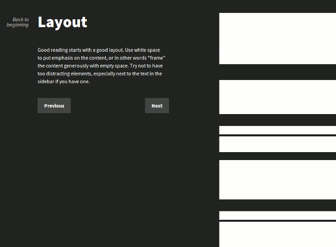
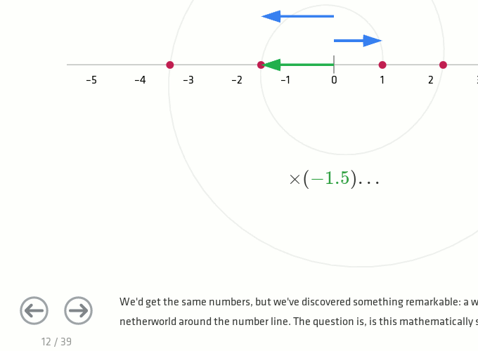

Title: 5 Examples for Great Interaction Design on the Web
Author: Tim von Oldenburg
Date: 2013-02-15

As I recently stumbled upon some greatly designed articles and sites&mdash;not alone thanks to [Sidebar](http://www.sidebar.io)&mdash;I wanted to share some of my findings. The following examples show how interaction design on a website can contribute to the user experience by involving the user in an entertaining and joyful way.

Most of the examples are&mdash;not by chance&mdash;educational. To me, they proof that a student's active engagement results in more effective learning, and that interactivity stimulates the will to learn and explore.

#### Hover States

[Hover States](http://hoverstat.es/) is a showcase for interaction design on the web, curated by London-based agency [Chambers Judd](http://chambersjudd.com/). If you are on the lookout for some inspiration, give this site a try, it's worth it. But beware, it is easy to get lost in exploring all those sites!

#### Try Git

The [Codeschool](http://www.codeschool.com/)-created web application [Try Git](http://try.github.com/) is a basic course on how to use Git. By simulating a terminal and file explorer, letting the user type all commands by himself and creating a real (like, super-real) Github repository, learning Git is simple and fun with this course.

#### Interactive Guide to Blog Typography

I have become a fan of the work of [Tommi Kaikkonen](http://www.kaikkonendesign.fi). Not because the work he does would be rocket-science, fancy interaction design, but because his posts and examples are well thought-out and greatly serve their purpose.

His [Interactive Guide to Blog Typography](http://www.kaikkonendesign.fi/typography/) is so simple, yet awesome. It educates the reader on the very basics of typography, while entertaining in a very subtle way.

#### How to Fold a Julia Fractal

Steven Wittens' article [How to Fold a Julia Fractal](http://acko.net/blog/how-to-fold-a-julia-fractal/) makes math fun. No text book I have seen so far explains complex numbers that visually rich&mdash;and of course, the interactivity provided by the web cannot be beaten by text books either. Somebody put a lot of work into this!

#### Kern Type, Shape Type & Color

[Method of Action](http://method.ac/) is a learning platform still in development. However, as part of their first course, *Design for Analytical Minds*, three games were released upfront: [Kern Type](http://type.method.ac/), [Shape Type](http://shape.method.ac/) and [Color](http://color.method.ac/). They train your eyes to recognize good kerning, harmonical letter shapes and subtle color differences, respectively. My maximum score at Kern Type is 92%, but I bet you can do better! :)

#### More examples

So, what do **you** think? Where have you experienced great interaction design on our beloved www? Feel free to tell me on [Twitter](http://twitter.com/sweeneytimm)!
