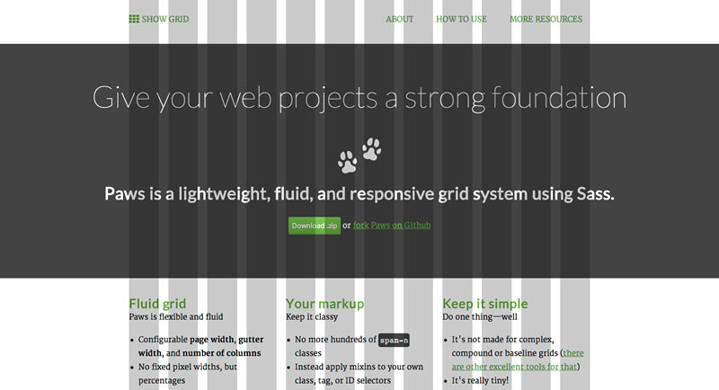

Title: Paws, a fluid grid
Date: 2013-05-01
Author: Tim von Oldenburg
Category: Article

This small project was born due to a need I have with almost every web project: A very simple grid system.

<a href="http://www.tvooo.de/paws/" target="_blank" class="btn">View Demo</a>

I did not study graphic design, so I am not familiar with the complexity a grid system can have. I know some of the simple grid rules for books, I know about the golden ratio, but let's be honest: for most of my web projects, I don't care.

I simply want a plug-and-play grid that stays out of my way, but is flexible enough for multi-column layouts and responsive design.

## Along comes Paws

[Paws](https://github.com/tvooo/paws) is a *really* simple grid for SASS. Here are all of the features:

* Define the number of columns
* Define a maximum width (either in % or px)
* Define the gutter width
* Mix the column span into your already existing class, ID or tag selectors

That's all. You can also generate those awful classes `span-1` to `span-n` you know from Bootstrap (*shudder!*) and use mixins to react to media queries (*yay!*).

No, this blog is not (yet) running on Paws, but I will apply it asap (that is, in a few months, I am lazy).

If you like, check it out [on Github](https://github.com/tvooo/paws) and leave a comment below!
