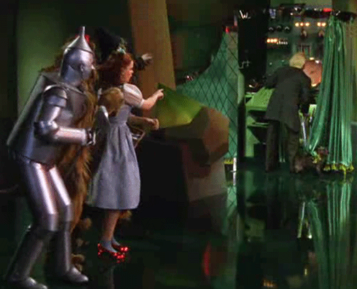
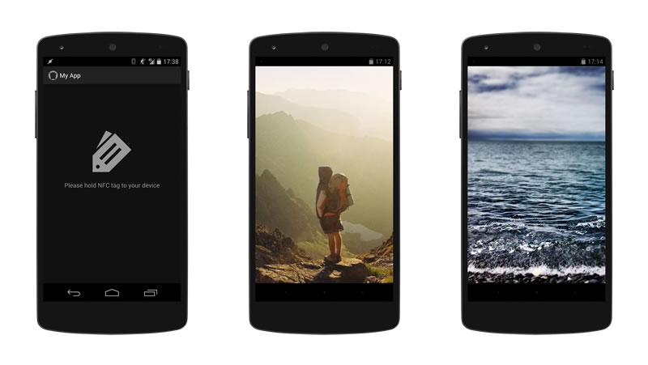

Title: ‘Wizard of Oz’ Prototyping for Android Apps
Author: Tim von Oldenburg
Date: 2013-12-13

There are times when you need to quickly sketch an Android app, be it for a proof of concept, a concept video, or a prototype intended for user testing. Using the right tools, you can do this without writing a single line of Java code.

The good thing about prototypes is that they don't have to be complete. But if you need to pretend a functionality to be implemented, for example reading from a sensor, then it might be good to use a technique called *[Wizard of Oz](http://en.wikipedia.org/wiki/Wizard_of_Oz_experiment)*. This basically means to fake unimplemented app behaviour by means of a (hidden) human actor.



In this tutorial, we will use *Wizard of Oz* by remote-controlling parts of the app and faking to read an NFC tag.

## The App

Our example app should be used to read NFC tags and show associated pictures on the screen. If a certain tag is read, it shows the picture of a hiker; reading another tag, it shows an old VW bus instead. Of course, all this functionality is faked. We will remote-control the app to show the right image depending on the NFC tag that is held up against the device (and yes, you don't even need an NFC tag for that; any object will do).

The photos are from [Unsplash](http://unsplash.com/).



The code from this tutorial is set up in this [Github Repository](https://github.com/tvooo/android-woz) which I refer to from time to time.

## Technologies and Tools

### Fries, an HTML Android UI library

Fries is a set of CSS and JavaScript to build Android-like User Interfaces with HTML. [Download Fries here](http://getfri.es/). The documentation could be more comprehensive, but the example templates are good enough for learning, too.

### Chrome for Android (beta)

We want our web app to appear as a native Android app. Chrome for Android allows us to add a website to our home screen, which then is started without the browser chrome and thus looks like a native Android app.

Unfortunately, at the time of writing, only the beta version of Chrome for Android (v32) supports this feature. You can get it on [Google Play](https://play.google.com/store/apps/details?id=com.chrome.beta).

### Socket.IO & Node.js

We will build a small server application to send events to our app. For implementing the server, we will use Node.js, and for client--server communication, we will use Socket.IO on both sides.

I assume that you have Node.js installed and are familiar with the basics (we won't use any fancy, async stuff). If not, that's cool, just [download and install it](http://nodejs.org/) and you'll figure it out on the go.

Socket.IO is a wrapper around the WebSockets API, but also provides backwards compatibility for older browsers through other technologies. As we are using a bleeding-edge browser (Chrome for Android beta), we could have just worked with WebSockets directly, but I think Socket.IO makes it more convenient.

### Grunt & Bower

Both Grunt and Bower are optional dependencies, but you should use them in favour of a better workflow. In this example, we use both of them, and I highly encourage you to try them out if you haven’t already.

## Setting up the App

### Preparations

If you want, you can fork and clone this [sample Github repository](https://github.com/tvooo/android-woz).

```
$ git clone https://github.com/tvooo/android-woz
```

If you have forked it before, make sure your username is used in the URL instead of mine.

Inside of the project folder, you now have to install the dependencies. As `bower.json` and `package.json` are set up correctly, you only need to run the following command.

```
$ npm install && bower install
```

This will install Fries, Socket.IO, the Socket.IO client library, Grunt plus one module, and Prompt, which is used to prompt for input on the server.

The *Gruntfile* is set up with the `grunt-contrib-connect` task, which allows us to run a server on our local machine for testing purposes. Typing

```
$ grunt
```

will start the server on port 9001 and open our app in the browser.

### Creating the Markup

Once you've downloaded Fries, take a bit of time to get familiar with it; especially look at the example app.

#### Activities

Fries uses one HTML file per [Activity](https://developer.android.com/training/basics/firstapp/index.html). If you click/tap a button to change to a new activity, it loads the respective HTML file via AJAX and then swaps out the content of the `.page` DIV.

```markup
<div class="page">
  <header class="action-bar fixed-top">
    <a class="app-icon action" data-ignore="true">
      <i class="icon-logo"></i>
    </a>
    <h1 class="title">My App</h1>
    <ul class="actions pull-right" data-overflow="false">
      <li>
        <a href="settings.html" class="action"
           title="Settings" data-transition="push">
          <i class="icon-settings"></i>
        </a>
      </li>
    </ul>
  </header>
  <div class="content">
    <div class="bg-image"></div>
  </div>
</div>
```

The `.page` DIV contains everything visible in your app. In it, it has a `header.action-bar` and a `div.content`, which represent the Action Bar and the Activity's content, respectively.

For our NFC reading app, we set up 3 different pages:

- `index.html` is the main Activity, which display a message that asks the user to hold an NFC tag to the device
- `item1.html` and `item2.html` are Activities that show images depending on the NFC tag we scanned.

Have a look at the different activities in the repository: [`index.html`](https://github.com/tvooo/android-woz/blob/master/index.html), [`item1.html`](https://github.com/tvooo/android-woz/blob/master/item1.html), and [`item2.html`](https://github.com/tvooo/android-woz/blob/master/item2.html).

#### Hidden links to activities

Fries doesn’t provide us with a function call to just switch to another Activity. The only way to do this is by using Buttons, List Items or similar “tappable” elements. We will create a hidden row of buttons outside of the `.page` DIV and fire the `touchend` event whenever we want to change to another Activity.

## Sending events from the Server

For remote controlling the NFC event in the app, we create a simple Node.js application

```javascript
var io = require('socket.io').listen(9003),
    prompt = require('prompt');

prompt.start();

function sendCommand() {
    prompt.get(['command'], function (err, result) {
        io.sockets.emit('sendEvent', { item: result.command });
        sendCommand();
    });
}

io.set('log level', 1);

io.sockets.on('connection', function (socket) {
    console.log('Client connected');
});

sendCommand();
```

Bla bla

## Receiving events on the Client

```javascript

```

## Performing the Wizard of Oz

The actual performance of the Wizard of Oz prototype needs two actors:

- the *user*, who uses the prototype as if it was a real app
- the *wizard*, who acts invisibly, sending commands from the computer to the app to fake incomplete behaviour

For a concept video, it might be enough to just film the user, as it is shown in the GIF below.


For user testing an app, it might be good not to reveal the wizard. If he has to be in the same room, for example to watch the user's actions, he can be presented as a note-taker. His actual role can be revealed to the user in a feedback conversation.

## Conclusion

*Wizard of Oz* prototyping with web technologies has many advantages, but also some drawbacks, depending on what you want to achieve. Here are a few use cases where you can make it work:

- High-fidelity prototyping
- Concept presentations, for example using a video
- User testing
- Feature exploration

The two main advantages of this Wizard of Oz technique come to mind quickly:

- It’s *rapid*. Writing a bit of HTML markup is so much quicker than setting up an Android project in Eclipse and creating lots of classes and XML files.
- It’s *simple*, yet effective. The Wizard of Oz is great at testing features that are not implemented yet.

One important aspect of a prototype is that it should be *disposable*. This might or might not be true for your project. If you want to implement a web application anyway, and use a technology such as PhoneGap, you might as well use your prototype and just replace the Wizard of Oz parts once they are ready.

If, however, your end goal is to create a native Android app, then the technology you’re prototyping with is not the technology of your final product.

- You will have to live with the fact that this prototype will be thrown away eventually.
- This also implies that you need a broader knowledge of technologies and programming languages than if you would only work with either Java or web technologies.

That said, I still think that this technique is worth exploring and very useful. I presented a very concrete example using web technologies, but there are many more ways. Just use what works best for you.