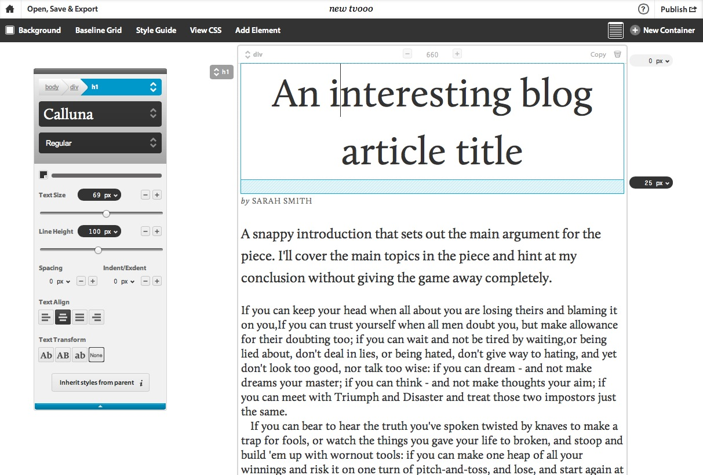
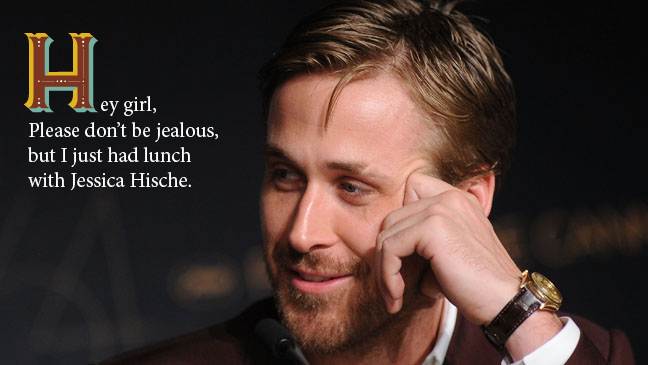

Title: Using web type today
Author: Tim von Oldenburg
Date: 2012-12-13
Category: Article
ImageX: letters.jpg

A while ago, [I wrote an article](/articles/web-fonts/) on the problems we had with typography on the web and how web fonts and next-generation CSS begin to solve them. Today I want to give an overview on techniques and services that allow us to create beautiful web typography already now.

## Web fonts

Using the CSS `@font-face` directive, we can easily embed font files of different formats into our websites. If you host your own font files, you can have a look at [this website][fontface] to see how it works. Interesting side fact: the WOFF format, which serves as a container for OpenType and TrueType fonts, has recently become a [W3C recommendation][woff].

However, there are many reasons for you to not host web fonts yourself, including licensing. There are paid as well as free services that offer a wide variety of font families, and there are good use cases for both of them. If, for example, you have a lot of clients and need distinct, high quality fonts for their websites, a paid service is the way to go. If, on the other hand, you are building a free Wordpress theme using a specific font, you cannot expect every user of that theme to buy the font. In that case, a free web font service is the better solution.

#### Free web font services

* [Google Web Fonts][gwf] is a free service offering a couple hundred fonts. Many of them are either not complete families, or they are not very professional, but there are some gems - you just need to find them. A very nice collection is maintained by [Chad Mazzola][bwt], and there are two articles by Sacha Greif [here][sacha1] and [here][sacha2].
* [Adobe Edge Web Fonts][adobe] is service that launched recently. It serves web fonts for free, powered by Typekit's distribution network.

#### Paid web font services

The following services usually differ in the plans they are offering, as well as in their font portfolio.

* [Typekit][typekit] offers a free plan (which I am using for this site) and four paid ones, starting at $24.99 per year. Typekit was acquired by Adobe some time ago. Although this issue caused a lot of discussion in the community, I like the work Adobe is doing towards open web standards, and especially, fonts. For example, Adobe released the beautiful [Source Code Pro][sourcecodepro] in October, which is a great font for every (web) developer's editor&mdash;and it's open source!
* [Fonts.com][fonts] powers fonts from both [Linotype][linotype] and [Monotype][monotype], for example the well-known *Neue Helvetica*. They also have a free plan, and the two paid plans start at $10.00 per 30 days.
* [Fontdeck][fontdeck] does not offer a free plan, but&mdash;in difference to the other services&mdash;you get billed on a per-font basis. The prices start at $2.50/year per font.

## Ligatures & more

This [advent calendar article][ligatures] inspired me to play around with OpenType features a little bit more. You can easily enable ligatures, old-style numerals and more in CSS3 with a single line. Note that Webkit and Firefox need their respective prefixes `-webkit-` and `-moz-`.

* Common ligatures: `font-feature-settings: "liga";`
* Discretionary ligatures: `font-feature-settings: "dlig";`
* Old-style numerals: `font-feature-settings: "onum";`
* Automatic fractions: `font-feature-settings: "frac";`
* Better kerning: `font-feature-settings: "kern";`

All those features can be combined by listing them:

```css
font-feature-settings: "liga", "frac";
```

Font feature settings are [currently supported](http://caniuse.com/#feat=font-feature) by Internet Explorer 10, Firefox since version 16, and Chrome since version 23. Safari partially supports them, Opera unfortunately doesn't, but this should not stop you from using them!

Also, be aware of the fact that the typeface of your choice must have those glyphs included. Most web fonts over at Google don't, and in Typekit you always have to enable the full character set&mdash;which could blow you website's load time.

## Hands-on typesetting with Typecast

Typecast is a new web application that allows you to design with type right in your browser. It features fonts from Typekit, Google, Fontdeck, Monotype (which acquired Typecast in October 2012), and others. With this wide variety of font families available, it is a powerful tool for every web designer. I can only encourage you to [give it a try][typecast].



## Why would I want to care about typography?

Typography is usually a designer's job, that is right. But typography is not only about looks and brand&mdash;it contributes to a good user experience, and thus should be (at least a little) important to everyone involved in building a website. Dmitry Fadeyev over at UsabilityPost gets to the conclusion that [typography matters][usability], and I am convinced that this is true.

Many websites contain a lot of text, and in most cases we want our users and visitors to read this text&mdash;and enjoy reading it. If you know a little of the basics of typography, no matter your role, you can contribute to a better user experience. You have all the tools you need at your fingertips.

## Where to learn about web typography

There are a lot of excellent resources on typography in general and applied to the web. You probably know Robert Bringhurst's "The Elements of Typographic Style". There is a *translation* of some of the book's chapters for the web, called [The Elements of Typographic Style Applied to the Web][elements]. It gives answers to questions like "How do I implement a specific leading using CSS?". Although this translation is far from complete, it is still a very good resource to start with.

Tommi Kaikkonen created an [Interactive Guide to Blog Typography][blog]. I really like the interactivity there, as you can play around with different CSS values and see the result applied directly. Great work, Tommi!

If you speak German you should definitely give [Typefacts][typefacts] a try. There is also a quite good cheat sheet over at [Playtype][playtype]. And if you have some minutes left of the day, don't forget to check out our all-round hero [Typographer Ryan Gosling][ryan]!



[drweb]: http://www.drweb.de/magazin/webtypobuch-alles-rund-um-typografie-im-web-37852/
[typekit]: http://www.typekit.com/
[linotype]: http://www.linotype.com/
[monotype]: http://www.monotype.com/
[fontdeck]: http://fontdeck.com/
[fonts]: http://www.fonts.com/web-fonts
[gwf]: http://www.google.com/webfonts
[adobe]: http://html.adobe.com/edge/webfonts/
[typecast]: http://www.typecastapp.com/
[fontface]: http://font-face.com/
[bwt]: http://hellohappy.org/beautiful-web-type/
[sacha1]: http://sachagreif.com/google-webfonts-that-dont-suck/
[sacha2]: http://sachagreif.com/more-google-webfonts-that-dont-suck/
[sourcecodepro]: http://blogs.adobe.com/typblography/2012/09/source-code-pro.html
[elements]: http://webtypography.net/
[woff]: http://www.w3.org/TR/2012/REC-WOFF-20121213/
[ligatures]: http://advent2012.digitpaint.nl/3/
[blog]: http://www.kaikkonendesign.fi/typography/
[ryan]: http://typographerryangosling.tumblr.com/
[typefacts]: http://typefacts.com/
[playtype]: http://dev.e-types.com/playtype/about/typefaces/glossary
[usability]: http://www.usabilitypost.com/2012/11/23/effects-of-typography-on-reader-mood-and-productivity
